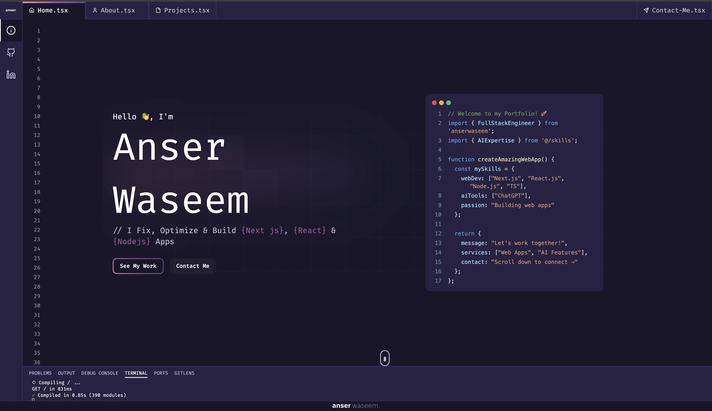

# Developer Portfolio - Next.js 15 & React 19

A modern, responsive, and performance-optimized developer portfolio website built with the latest Next.js 15 and React 19. Showcase your skills, projects, and expertise with a beautiful, animated UI.



## ✨ Features

- **Modern Tech Stack** - Built with Next.js 15 and React 19
- **Responsive Design** - Looks great on all devices
- **Performance Optimized** - Fast loading times and smooth animations
- **Animated UI** - Beautiful transitions powered by Framer Motion
- **Section-Based Layout** - Home, About, Projects, Technologies, and Contact sections
- **Code Typing Animation** - Dynamic code typing effect in the Home section
- **Project Showcase** - Highlight your best work with images and descriptions
- **Skills/Technologies Display** - Visual representation of your tech skills
- **Contact Form** - Allow visitors to reach out directly
- **Dark Mode Support** - Built with Tailwind CSS for theming

## 🚀 Tech Stack

- **Framework**: [Next.js](https://nextjs.org/)
- **Language**: [TypeScript](https://www.typescriptlang.org/)
- **UI Components**: [Shadcn UI](https://ui.shadcn.com/)
- **Icons**: [Lucide React](https://lucide.dev/)
- **Code Highlighting**: [Prism React Renderer](https://github.com/FormidableLabs/prism-react-renderer)
- **Styling**: [Tailwind CSS](https://tailwindcss.com/)
- **Form Handling**: 
  - [React Hook Form](https://react-hook-form.com/)
  - [Zod](https://zod.dev/)
- **Animations**: 
  - [Framer Motion](https://www.framer.com/motion/)
  - [Lottie](https://lottiereact.com/)
- **Utilities**: [Lodash](https://lodash.com/)
- **Email Service**: [Resend](https://resend.com/)
- **AI Integration**: [Google Gemini](https://ai.google.dev/gemini/docs)
- **Deployment**: [Vercel](https://vercel.com/)

## 🛠️ Getting Started

```bash
# Clone the repository
git clone https://github.com/anserwaseem/my-website

# Navigate to the project directory
cd my-website

# Install dependencies
npm install

# Set up environment variables**
# Create a .env.local file with the following variables:
RESEND_API_KEY=your_resend_api_key # API key for email service
GOOGLE_API_KEY=your_gemini_api_key # API key for Gemini Pro AI (required for chat assistant)

# Run the development server
npm run dev
```

Open [http://localhost:3000](http://localhost:3000) with your browser to see the result.

## 📁 Project Structure

```
├── app/                  # Next.js 15 App Router structure
│   ├── (main)/           # Main app routes
│   ├── api/              # API endpoints
│   ├── globals.css       # Global styles
│   └── layout.tsx        # Root layout
├── components/           # React components
│   ├── layout/           # Layout components
│   ├── sections/         # Page sections (Home, About, etc.)
│   ├── ui/               # UI components
│   └── loading-screen.tsx
├── data/                 # Content data
├── hooks/                # Custom React hooks
├── lib/                  # Utility functions
├── public/               # Static assets
└── shared/               # Shared utilities
```

## 🚀 Deployment

This app is optimized for deployment on [Vercel](https://vercel.com/), to deploy:

1. Fork this repository
2. Create a new project on Vercel
3. Connect your forked repository
4. Add the required environment variables:
   - `RESEND_API_KEY`
   - `GEMINI_API_KEY`
5. Deploy!

## 🔧 Customization

Edit the `data/index.ts` file to customize your personal information, projects, skills, and contact details.

---

Developed with ❤️ using Next.js 15 and React 19
